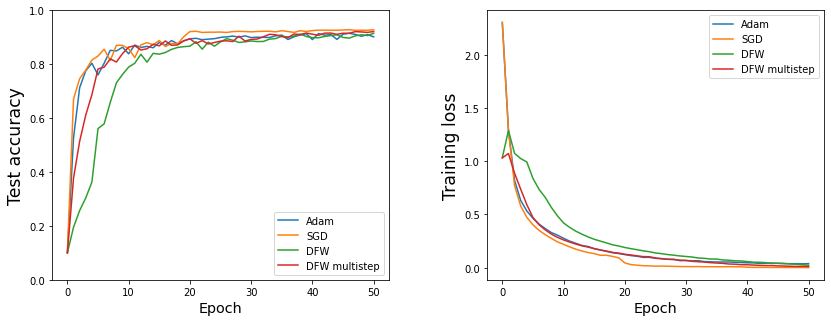

# Optimization for Machine Learning Project
This repository contains the implementation of the Block Coordinate Descent and of the Deep Frank Wolfe algorithm in Pytorch. The work is inspired by the two papers [Deep Frank-Wolfe for Neural Network Optimization](https://arxiv.org/pdf/1811.07591.pdf) and [Global Convergence of Block Coordinate Descent in Deep Learning](https://arxiv.org/pdf/1803.00225.pdf).

## Structure
* `Frank_Wolfe` - Folder containing the implementation of the Deep Frank-Wolfe Algorithm
  * `utils` - Contains utilities to load data-sets, normalize batches and other tasks
  * `architectures.py` - Contains the implementation of architectures used for the empirical experiments
  * `MultiClassHingeLoss.py` - Contains the implementation of the multi-class Hinge Loss as described in the original DFW paper
  * `DFW.py` - Implementation of the DFW optimizer in Pytorch
* `results` - Contains the Python dictionaries with the results
*  `DFW.ipynb` - Notebook for reproducibility of the results concerning Deep Frank-Wolfe 

## Requirements
Requirements for the needed packages are available in requirements.txt. To install the needed packages, please run:\
`pip install -r requirements.txt`
## Reproducibility
We provide two notebook `DFW.ipynb` and `CD.ipynb` for reproducibility of the obtained results. 
Because of the size of the architectures which were tested, we recommend using a GPU to check the correct training trends. 

## Example of usage
* Deep Frank-Wolfe
```python
eta = 0.1  # proximal coefficient
momentum = 0.9  # momentum parameter
optimizer = DFW(model.parameters(), eta=eta, momentum=momentum,
                prox_steps=2)  # define optimizer with multistep

optimizer.zero_grad()
output = model.train()(x)
loss = loss_criterion(y, output)
loss.backward()
optimizer.step(lambda: float(loss), model, x, y)  # needs to have access to the loss and the model
```
* Block Coordinate Descent
  * TODO: John

## Results

### Coordinate Descent

#### MNIST DATASET


| 4-layer perceptron   |  Test accuracy (%)|  Time per epoch
|:---------------------|-------------------|-------------------|
| BCD                  | 94.54             |      1.62         |
| Adam                 | 96.46             |      16.21        |
| Prox Linear          | 94.56             |      2.03         |
| BCD(GD update)       | 93.68             |      1.84         |
| SGD (with schedule)  | 94.52             |      9.9          |
| BCD + Adam           | 95.85             |      7.1          |
| BCD + SGD            | 95.56             |      5.1          |

##### Hyperparameters used

* Block Coordinate Descent: γ = 0.1, α = 4.
* Adam: γ = 0.001, β1 = 0.9, β2 = 0.999.
* SGD: γ = 0.01, μ = 0.9, scheduler StepLR(stepsize=15,
gamma=0.2).
* Block Coordinate Descent with Prox Linear VN update:
γ = 0.1, α = 4.
* Block Coordinate Descent with GD update (4) for VN :
γ = 0.1, α = 4, T = 250, ηt = O (1/T).
* Block Coordinate Descent: γ = 0.1, α = 4

### Frank Wolfe
#### CIFAR10
| GoogLeNet            |  Test accuracy (%)|
|:---------------------|-------------------|
| SGD (with schedule)  | 92.79             | 
| DFW                  | 90.89             |
| DFW multistep        | 92.13             | 
| Adam                 | 91.45             |

| WideResNet          | Test accuracy (%)  |
|:--------------------|------------------- |
| SGD (with schedule) | 90.57              | 
| DFW                 | 91.45              | 
| DFW multistep       | 92.40              |  
| Adam                | 91.31              | 

We see from the table above how the multistep algorithm we propose in the first epochs
of training outperforms the standard one. The figure below confirms the better training
trend in the early stage for the GoogLeNet architecture.



## Report
The report in pdf format can be found in the folder `report`.

## Authors
- Federico Betti
- Ioannis Mavrothalassitis
- Luca Rossi
